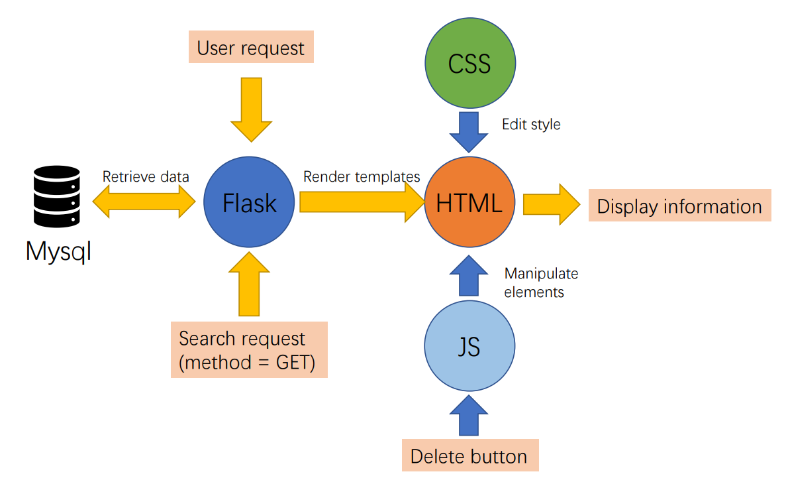

# Report of Web Development Homework
By Huang Haoxv
## Purpose
- To develop an website that provides information of papers.
- To retrive data from dataset and display it on website.
- To add interactive components to the web page.
- To apply basic search feature.

## My work


## Environment
- Python 3.9.7
- Flask 2.0.1
- PyMySQL 1.0.2
- Mozilla FireFox 93.0

***
## Page 1
Randomly select 10 papers from dataset and display their information in a table at every visit.
### Randomly retrieve data
- First, connect to mysql dataset with pymysql.
- Second, get column names. Column names of the whole server are stored in information_schema.columns.
- Then, retrieve data randomly. This can be achieved by order randomly and select first 10 records.
  ```python
  # connect to Mysql
    try:
        conn = pymysql.connect(host="server.acemap.cn",
                                port=13306,
                                user="ieei",
                                passwd="ieei_2021",
                                charset="utf8",
                                db="ieei_web")
        cursor = conn.cursor()
    except:
        print('Fail to connect to the database.')
        exit(-1)

    # get table colomn name
    cursor.execute("SELECT column_name FROM information_schema.columns \
                    WHERE TABLE_SCHEMA='ieei_web' AND table_name='paper'")
    labels = cursor.fetchall()
    labels = [i[0] for i in labels]
    # get 10 table content
    cursor.execute('SELECT * FROM paper \
                    ORDER BY RAND() \
                    LIMIT 10')
    content = cursor.fetchall()
    ```

### Modify data
- Remove seperator and brackets.
- For case that there are more than one author or keyword, add breakline between them.

### Render HTML
- To fill in the data, we can apply HTML templates and `flask.render_template('<html>', <parameter>=<local parameter>)` method.
- To avoid repeated work, I applied loops in the templates. It will loop over the `labels` and `content` to create rows and columns of the table.
```html
<table>
    <tr>
        
        <th>
            {{i}}
        </th>
        
    </tr>
    
    <tr>
        
        <td> {{j}} </td>
        
    </tr>
    
</table>
```
***
## Page 2
Based on page1, page 2 provides delete buttons which delete the corresponding table row on click.
### Add buttons to page
- This is implement with Javascript.
  ```javascript
  let btn=[];
  for(i = 0; i < 10; i++) {
    btn[i] = document.createElement('button')
    btn[i].textContent = 'Delete';
    document.getElementsByClassName('operation')[i].appendChild(btn[i]);
  }
  ```
  - `let` defines an array which later will store buttons.
- `document.createElement('button')` creates a button and return its pointer.
- `textContent` determine the text to be displayed on the button.
- `document.getElementsByClassName('operation')[i]` choose the block that the button will be placed in.
- `appendChild()` Now the button is finally placed into the HTML.

### Validate the button
- The buttons are there. But they won't work now.
- Validate the buttons by add event listener and binding function to them.
  ```javascript
  btn[i].addEventListener('click', 
    function() {
        this.parentNode.parentNode.parentNode.removeChild(this.parentNode.parentNode)
    });
  ```
- `addEventListener` trigger the anonymous function on click.
- In the function, the `<table>` node is selected and remove its child `<tr>` which the button is in.

***
## Page 3
Page3 includes a search box. When user inputs paper id, the page reopens and passes the id as a parameter. The backend retrieves the paper data and displays it in the table.
### Search box
- The search box can be implemented with `<form>` element.
  ```html
  <form action="/pages/page3" name="searchId" method="get">
    <label>Paper ID: </label>
    <input type="text" name="searchField">
    <input type="submit" value="Search" class="IDSubmit">
  </form>
  ```
- The `action` attribute of form determine the page to go after submit.
- The `method` attribute determine the method of passing parameters, including 'GET' and 'POST.
- 'GET' adds the parameter directly after URL, while 'POST' establishes an independent TCP/IP connection. 'GET' is more efficient, while 'POST' is able to transport larger amount of data. Here I choose 'GET' to pass the paper id.
- The `name` attribute of `<input>` determine the parameter name in URL.

### Backend
- To recieve and process the 'GET' request, I changed the `app.route()` decorator.
  ```python
  @app.route('/pages/page3', methods=['POST', 'GET'])
  def SearchbyId():
      if flask.request.method == 'POST':
          paperid = flask.request.form['searchField']
      else:
          paperid = flask.request.args.get('searchField','')
  ```
- The parameter is visited with `request.args.get`
- To retrieve data, simply append `paperid` to `WHERE` clause.
  ```python
  cursor.execute('SELECT * FROM paper \
                    WHERE paper_id={}'.format(paperid))
  ```

***
## Conclusion
In this homework, I implenmented a simple but complete website. It offered me a brief portrait of the web development.